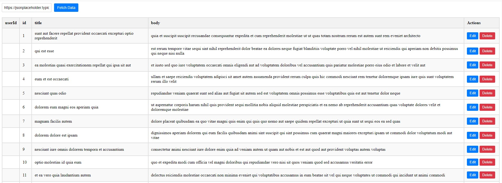

# Revlib

**A Revolutionary Vue 3 Library**

- **Dynamic Table Creation and Updates**: This Vue 3 library dynamically creates and updates tables based on API calls.
- **AI-Powered Column Detection**: You can test any API here with any number of columns. Its AI feature will automatically detect the number of columns and create a table accordingly.
- **CRUD Operations**: It provides EDIT and DELETE features, just like a standard CRUD system.
- **Add New Records**: The library also allows you to add new records to API calls.
- **Versatile Use**: You can use it for API testing or easily add CRUD functionality to your project.

## Screenshot



## Upcoming Features

- **Full Control**: You will have full control over the CRUD table, including customization options.
- **Responsive Design**: The table will adjust according to the space or frame provided by you.
- **Selective Columns**: You will be able to delete columns from the API, showing only the required ones.
- **Pagination**: Pagination will be provided for handling larger APIs.
- **API Merging**: Capability to merge two APIs and display them at once.
- **Record Selection**: You can choose the number of records to display.
- **Advanced Search**: Both global and column-wise search capabilities will be available.
- **Sorting**: Sorting order will be provided for better data management.
- **Column Trimming**: Trimming options for columns with larger entries.

Isn't that amazing?

## Installation

```sh
npm install revlib

import DynamicTable from 'revlib';
import "revlib/dist/style.css";

<DynamicTable />

give any Json Api Address in checkbox like this 'https://jsonplaceholder.typicode.com/posts' and click Fetch


